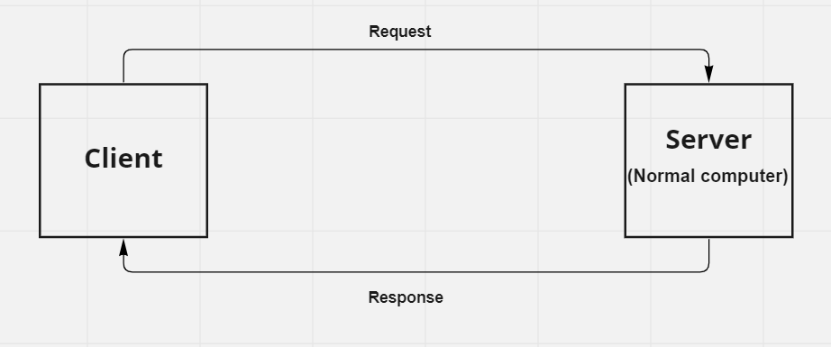

# Movies Library - 1.0.0

**Author Name**: Mohammad AbuMazen

## WRRC

## Overview

## Getting Started

* create a package.json using npm init command
* install the express tool using npm install express command
* require the express package
* create express app
* server is listening to the port
* create routes
* create a constructor for the JSON-data

## Project Features

* Home-page for the information of the webstie
* favorite-page
* trending-page
* search-page
* popular-page
* topRated-page
* The client can add Movies to the DataBae
* The client can see Movies saved in the DataBase
  